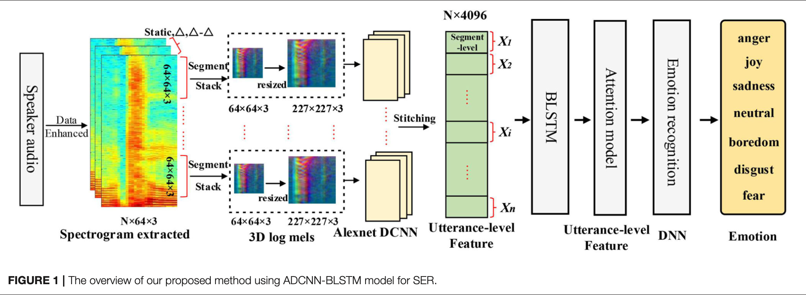

# DCNN-BLSTMWA
Deep CNN and Bidirectional LSTM With Attention model for Speech Emotion Recognition

## Model Architecture

Implemented with reference to the [this paper](https://www.frontiersin.org/journals/physiology/articles/10.3389/fphys.2021.643202/full "Pre-trained Deep Convolution Neural Network Model With Attention for Speech Emotion Recognition")

## Dataset
### Japanese: JTES
- 16bit, 48kHz(downsampling to 16kHz)
- 100 speakers(50 males, 50 females)
- 4 emotions(Angry, Sad, Joy, Neutral)
- 50 files per emotion of one speaker
- sentence parallel 
- 50 * 4 * 100 = 20000 files

### English: [ESD](https://github.com/HLTSingapore/Emotional-Speech-Data "ESD dataset")
- 16bit, 16kHz
- 10 speakers(5 males, 5 females)
- 5 emotions(Angry, Sad, Joy, Neutral, Suprise)
- 350 files per emotion of one speaker
- sentence parallel 
- 350 * 5 * 10 = 17500 files
- This model used 4 emotion(Angry, Sad, Joy, Neutral) -> 14000 files

## Model training step
### step -1: download, resample, and amp normalize datasets 
You must place datasets as follows. (`[dname]` means dataset name.)
```
dataset/[dname]
```

### step0: prepare filelists
```
python filelists/[dname]/**/011_prep_mydata_[dname].py
```

### step1: finetuning DCNN model
```
nohup ./**_finetune.sh > nohup.out &
```
Log files are generated in `logs/**/log_finetune.out`.
Confusion matrix are saved in `resource`.

### step2: train DCNN-BLSTMWA model
```
nohup ./**_train.sh > nohup2.out &
```
Log files are generated in `logs/**/log_train.out`.
Confusion matrix are saved in `resource`.

### step3: inference
```
python inference.py [modelpath(step2)]
```

## Tools
### resample.py
resampling audio file(s)

- usege
```
python resample.py [-h] [-s] src_dir dst_dir sr
```

- positional arguments:

  `src_dir`       src dataset directory path

  `dst_dir`       dst save directory path

  `sr`            convert to this sr

- optional arguments:

  `-h`, `--help`    show this help message and exit

  `-s`, `--silent`  omit info(pbar, etc.)

### amp_normalize.py
Normalize amplitude of wavfiles to 0-1.

- usage
```
python amp_normalize.py [-h] src_dir dst_dir
```

- positional arguments:
  
  `src_dir`     dir_path (dir has wav files you want
              to normalize)

  `dst_dir`

- optional arguments:
  
  `-h`, `--help`  show this help message and exit

### hparams_changer.py
Change hyperparameters in JSON file(s). You can use this tool with two different ways.

- commandline mode
```
python hparams_changer.py [-h] [-p PATH]
                          [-y HYPARAM] [-v VALUE]
```

- optional arguments:
  `-h`, `--help`            show this help message and
                        exit

  `-p` PATH, `--path` PATH

  `-y` HYPARAM, `--hyparam` HYPARAM
  
  `-v` VALUE, `--value` VALUE

- dialogue mode
```
python hparams_changer.py
```

You can change hyperparameters of the JSON files in `config_list`.
Edit `config_list` in this program to change targets in dialogue mode.